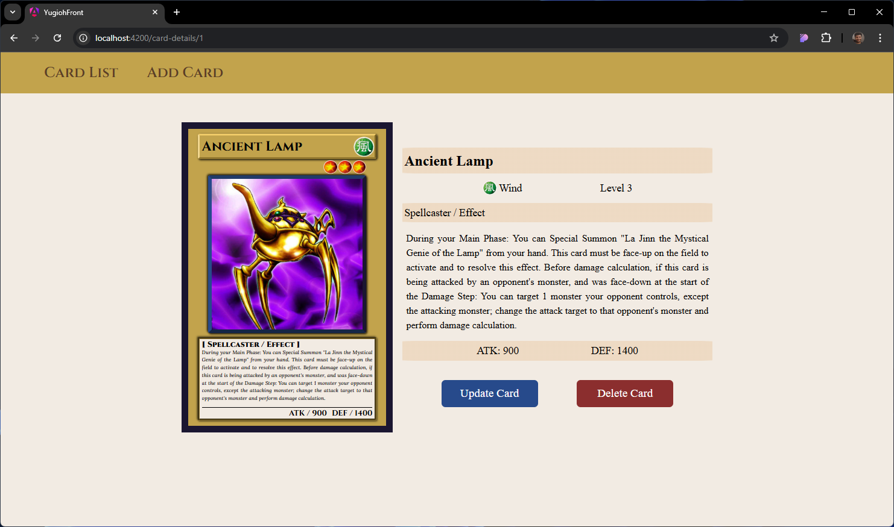
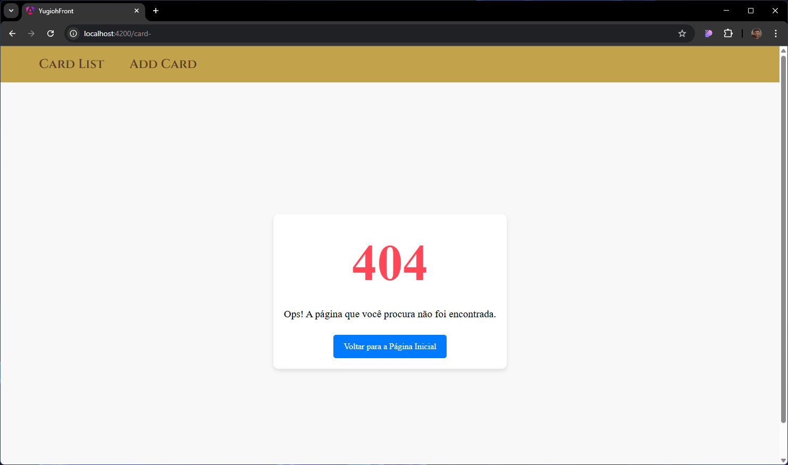

# YU-GI-OH! Cards (CRUD)

This project was generated using
[Angular CLI](https://github.com/angular/angular-cli) version 19.1.5.

## Index

- [YU-GI-OH! Cards (CRUD)](#yu-gi-oh-cards-crud)
  - [Index](#index)
  - [About the project](#about-the-project)
  - [Technologies Used](#technologies-used)
  - [How to Use](#how-to-use)
    - [Prerequisites](#prerequisites)
    - [Setup and Run](#setup-and-run)
  - [Project Structure](#project-structure)
    - [Created Components](#created-components)
    - [Backend](#backend)
    - [Screenshots](#screenshots)
    - [Future Improvements](#future-improvements)
  - [Reference](#reference)

## About the project

This project was developed with the goal of learning how to create a CRUD
(Create, Read, Update, Delete) in Angular 19. During development, concepts such
as routing, HTTP requests, interfaces, services, and standalone components were
explored.

## Technologies Used

- Angular 19
  - Routing
  - HttpClient
  - Interfaces
  - Services
  - Standalone Components
- json-server
- Pure CSS3 (for UI styling)

## How to Use

Follow these steps to set up and run the project:

### Prerequisites

Make sure you have the following installed:

- **Node.js** (Download and install from [nodejs.org](nodejs.org))
- **Angular CLI** (Install globally with `npm install -g @angular/cli`)
- **json-server** (Install globally with `npm install -g json-server`)

### Setup and Run

1. **Clone the repository:**

   ```terminal
   git clone https://github.com/Wiklyn/yu-gi-oh--cards-crud
   ```

2. **Open the project in an IDE (e.g., Visual Studio Code, WebStorm, or any preferred IDE).**
3. **Install dependencies:**

   ```terminal
   npm install
   ```

4. **Start the json-server:**

   ```terminal
   json-server --watch db.json
   ```

5. **Run the Angular project:**

   ```terminal
   ng serve
   ```

   or

   ```terminal
   ng s
   ```

6. Open your browser and go to `http://localhost:4200/` to view the application.

## Project Structure

The file structure is organized as follows:

```terminal
.
├── app/
│   ├── components/
│   ├── models/
│   └── services/
```

Files were generated using the Angular CLI.

### Created Components

- AddCardComponent: Form to add new cards.
- CardDetailComponent: Displays the details of a specific card.
- CardListComponent: Lists all registered cards.
- PageNotFoundComponent: Displayed when the requested route does not exist.
- UpdateCardComponent: Form to update an existing card.

### Backend

The backend used was json-server, which allows simulating a RESTful API with a
local database. The database is included in the project directory.

### Screenshots

The main page is the card list page:


When you click in any card, you are redirected to the Card Details page:



In this page tou can Update or Delete the card. In case you click on the Delete
button, the card will be deleted and you will be redirected to the main page. In
case you click in the Update button you will be redirected to the Update Form
Page:


After finishing the changes and clicking on the Update button, you will be
redirected to the main page.

In case you want to Add a card, you can click on the `Add Card` link on the
navbar and you will be redirected to the Add Form Page:


After typing the card data and clicking on the Add button, you will be
redirected to the main page.

In case you try to enter in a unmapped url, you will see tha Not Found Page:



### Future Improvements

- Fix styling issues and making the pages responsive.
- Replace **json-server** with a real backend and add data validation:
  - Database: **SQL Server** or **PostgreSQL**.
  - API developed in **.NET 8**.

## Reference

This project was inspired by the video
[#21 - Angular 19 Tutorials | Angular 19 CRUD Operations with JSON Server](https://youtu.be/1Cr4cS6JkYQ?si=SuOyalsr3kgP6Fn3),
from the [Angular 19 Tutorials](https://youtube.com/playlist?list=PLBz0Y_rVMoZi8a8bRsK4Vr3c2SFrmhhoL&si=-piv8oF-zmq68Hii)
playlist on the [FED Learning channel](https://www.youtube.com/@FEDLearning).
Additionally, I also studied the official Angular documentation to deepen my
understanding of the concepts.
